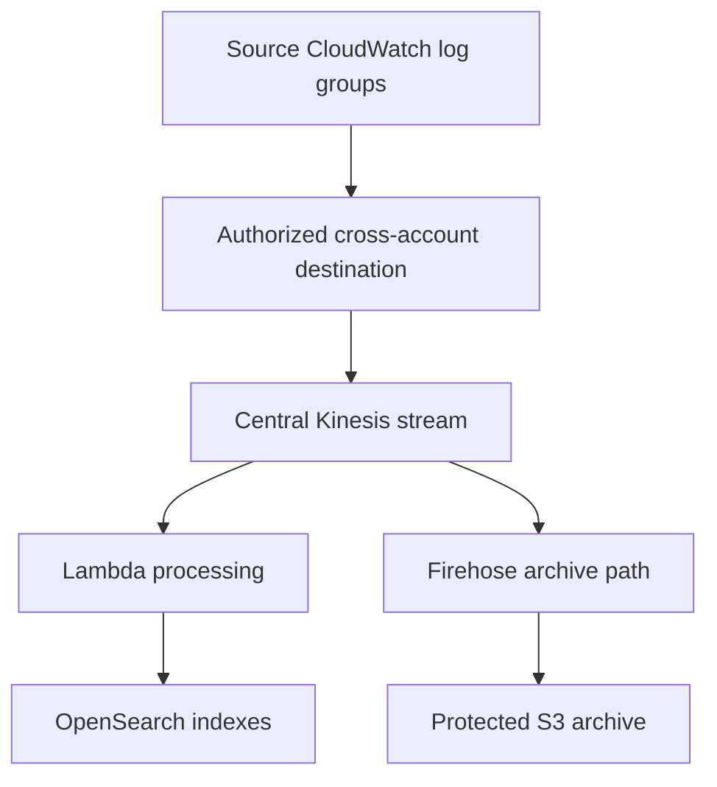

# Centralized Logging Architecture

## Organization compliance requirement

Collect relevant application/service logs, preserve source identity, deliver them to the compliance account, keep a durable retained copy, and provide the requested search mechanism. Configure **current and future** accounts/Regions explicitly.

For VPC flow logs, first choose/configure a supported flow-log destination. A CloudWatch subscription cannot collect flow logs that were never delivered into the log group.

## Transcript-compatible indexed pipeline

This is a pattern, not a ready-to-deploy policy/template. The central stream permits separate consumers. Processing must decode/decompress log batches and produce individual documents.

## Alternative choices

- Native CloudWatch Logs centralization → centralized log groups → Logs Insights, if those search/storage requirements suffice.
- Cross-account logical destination backed by Firehose → S3 → Athena for managed delivery and archive SQL.
- Kinesis → supported OpenSearch Ingestion pipeline where its source/format/configuration fits.

Native centralization handles new log data after rule creation; historical backfill needs a separate plan. OAM federation does not make an independent central archive.

## Onboarding and controls

| Concern | Required design |
|---|---|
| Future accounts/groups | Organization/OU scope or automated account-level policy/onboarding deployment |
| Source identity | Account, Region, log group/service, event time and event ID |
| Completeness | Forwarding errors/throttles, consumer lag, failed records, test events |
| Security | Receiver/sender IAM, trust/destination/bucket policies, keys and network access |
| Retention | Source/destination log retention, S3 lifecycle, index lifecycle |
| Pipeline safety | Duplicate handling and exclusion of recursive processor logs |

Do not assume a one-time filter on today's groups includes tomorrow's accounts. Central retention/indexing and source retention have separate ownership.

Tasks 4.1–4.3. See [[CloudWatch Log Subscriptions and Cross-Account Destinations]], [[Cross-Account Observability vs Log Centralization]], [[Log Lifecycle Security and Integrity]], [[Domain 4 Official Sources]].
