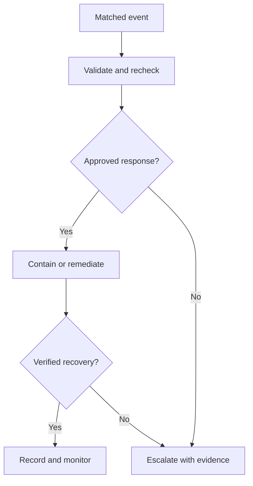

# Domain 5 Architecture Patterns

## Event-source decision

CloudTrail for API actor activity, Config for recorded compliance, CloudWatch alarms for numeric conditions, Health for AWS-impact notices, and native service events for their documented state transitions. Choose the source before choosing a response target.

## Bounded incident workflow

All branches retain correlation/evidence and handle duplicate events. A target DLQ captures delivery failures, not every failure inside an accepted workflow; monitor execution separately.

## Recurring architectures

| Need | Pattern | Safeguard |
|---|---|---|
| Custom public S3 permission state | Config rule → compliance event → scoped Lambda/Automation repair + SNS | Approved policy, exceptions and live-state check |
| Audited confidential-object actor | Explicit CloudTrail data events → EventBridge/handler → identity review | IAM policy enforces before access |
| Exposed long-lived key | Health → EventBridge → Step Functions containment/audit/notification | Exact key scope, no secrets in payloads |
| Scheduled AWS change | Health → EventBridge → SNS/OpsItem/approved runbook | Correct account/Region/service and impact plan |
| Candidate Lambda validation | Published target → pre-traffic hook → alias shift → post-traffic hook/alarms | Callback status and configured rollback |
| SSH rule repair | Config evaluation → SSM Automation → revalidation | Narrow approved CIDR, avoid lockout |
| ASG-dependent configuration | Relevant ASG event → reconcile live membership → Run Command | Idempotency, atomic safe update, hook completion if used |
| Dedicated Host audit | Config evidence → custom placement rule → report/remediation plan | Host versus dedicated-instance distinction |

Tasks 5.1–5.3. [[Domain 5 Scenario Decisions]], [[Domain 5 Transcript Corrections]], [[Event Sources and Response Contracts]], [[Safe Event-Driven Remediation]].
